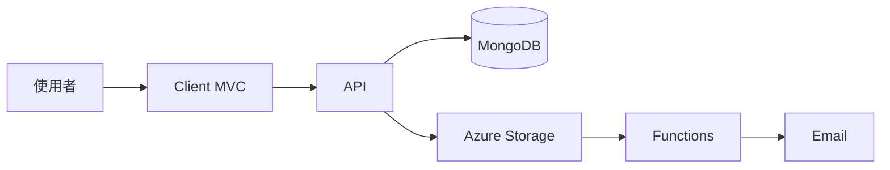
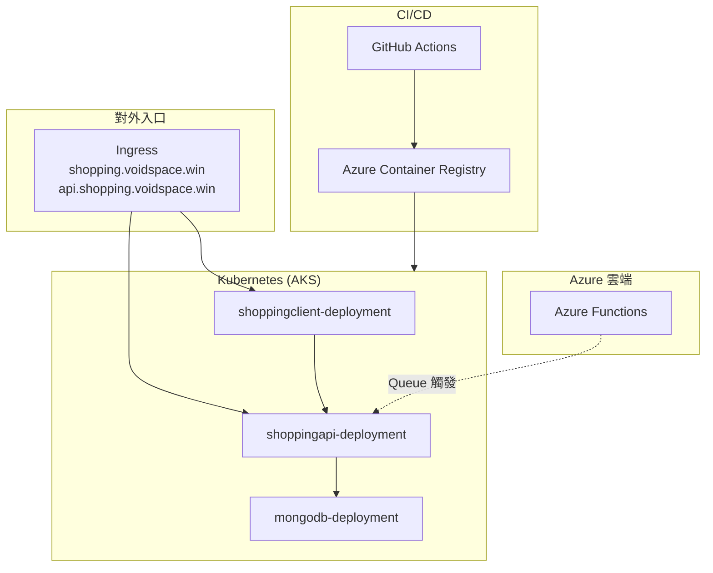

# Shopping Microservices - 學習專案

## 專案簡介
購物網站微服務架構，包含前端、API 和資料庫，部署在 Azure Kubernetes Service。

**線上展示(已關閉)：** https://shopping.voidspace.win/

**GitHub連結：** https://github.com/078void/devops_shopping

## 技術

| 層級 | 元件 | 技術 | 職責 |
| --- | --- | --- | --- |
| **前端** | Shopping.Client | ASP.NET MVC + Razor | 商品操作、圖片上傳、訂閱 UI |
| **後端** | Shopping.API | ASP.NET Web API | REST API、商品 CRUD、訂閱、圖片上傳 |
| **無伺服器** | Shopping.Functions | Azure Functions (.NET) | 價格變動處理、發送 Email 通知 |
| **資料庫** | MongoDB | Document DB | 商品資料 |
| **雲端** | Azure Storage | Blob / Queue / Table | 圖片、佇列、訂閱與價格歷史 |
| **CI/CD** | GitHub Actions |  Docker(ACR) / Kubernetes(AKS) | 建置、測試、部署到 ACR / AKS |

### 資料流

### 部署流程
- 推送程式碼到 GitHub
- GitHub Actions 自動觸發
- 建置 Docker Images
- 推送到 Azure Container Registry
- 部署到 Azure Kubernetes Service

| 資源 | 說明 |
|------|------|
| shoppingclient-deployment | 前端 MVC，Data Protection 透過 PVC |
| shoppingapi-deployment | 後端 API，2 replicas |
| mongodb-deployment | MongoDB 與持久化儲存 |
| ingress | 網域路由與 TLS（cert-manager + Let's Encrypt） |

## 學習成果

- [x] 建立完整的 .NET 微服務架構
- [x] 使用 Docker 容器化應用程式
- [x] 部署容器化服務至 Kubernetes(AKS)
- [x] 撰寫基礎單元測試
- [x] 實作 CI/CD Pipeline
- [ ] Terraform 多環境管理
- [ ] 整合 Azure Monitor 監控
